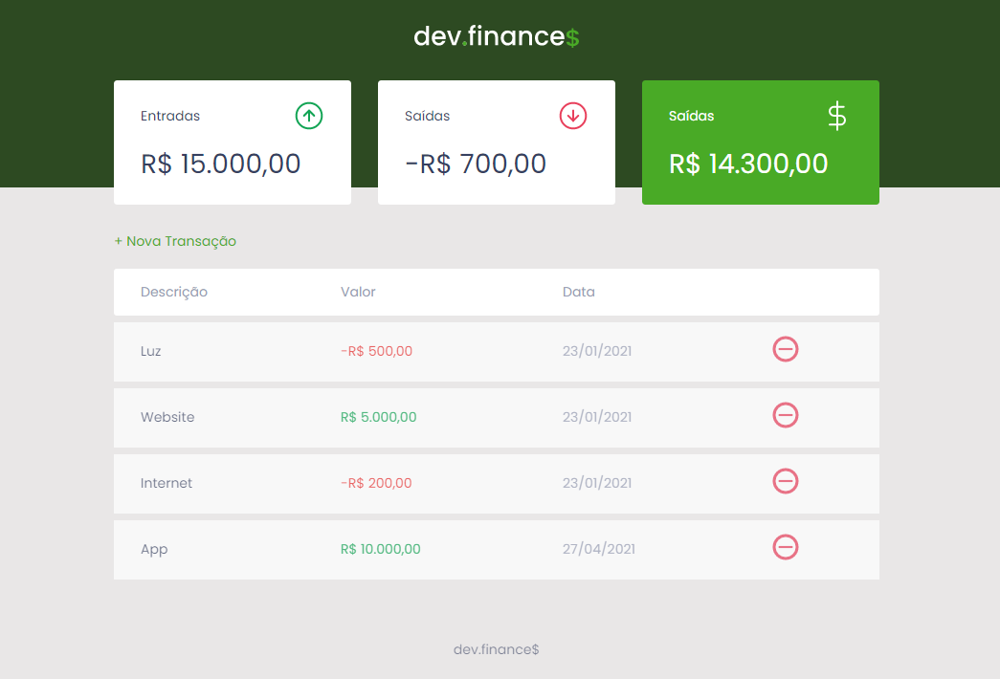

# dev.finance$

<h1 align="center">
  
</h1>

# Preview do app 👉 [dev.finance$](https://jnr23.github.io/projeto-devfinance/)

## 💻 Projeto

O dev.finances é uma aplicação de controle financeiro, onde é possível cadastrar e excluir transações e ver o saldo de entrada e saída 💰

## 🚀 Tecnologias

Esse projeto foi desenvolvido com as seguintes tecnologias:

- HTML
- CSS
- JavaScript

* Nenhum Framework foi utilizado